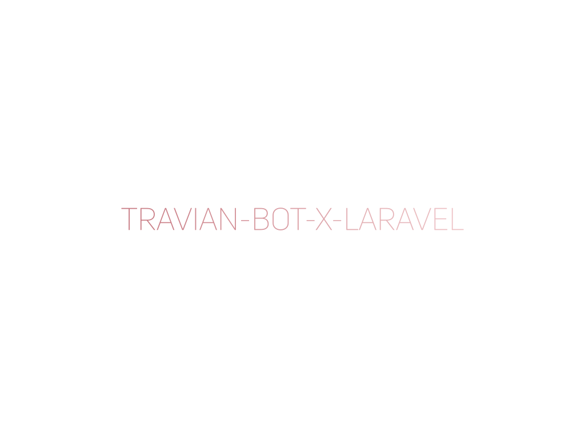

# Travian-Bot-X-Laravel

## Travian-Bot-X-Laravel

Travian-Bot-X-Laravel is a powerful and efficient helper tool designed for players of the popular online game Travian.
Built using the Laravel framework in PHP, this comprehensive bot offers automation features to streamline and enhance
your Travian gaming experience. From resource management to strategic decision-making, Travian-Bot-X-Laravel provides a
seamless integration of Laravel's robust capabilities, delivering a reliable and user-friendly solution for avid Travian
enthusiasts. Elevate your gameplay with the convenience and precision of Travian-Bot-X-Laravel.

## License

The Travian-Bot-X-Laravel is open-sourced software licensed under the [MIT license](https://opensource.org/licenses/MIT).
